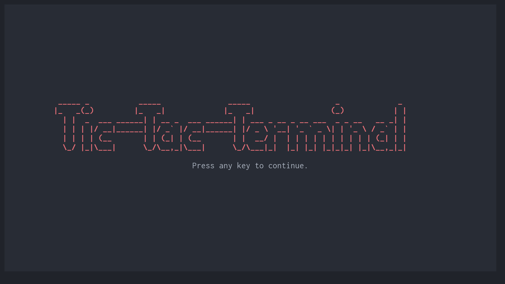
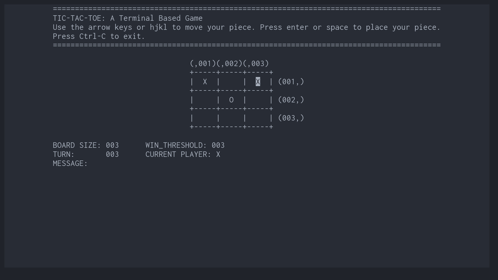

# Tic-Tac-Terminal



This is a terminal-based version of tic-tac-toe.
If no arguments are specified, a standard 3x3 tic-tac-toe game will be chosen as the default.

Command line options allow the specification of board size, and win threshold.
For example:

```
./tic_tac_toe 5 3
```

produces the following board:

```
(,001)(,002)(,003)(,004)(,005)
+-----+-----+-----+-----+-----+
|     |     |     |     |     | (001,)
+-----+-----+-----+-----+-----+
|     |     |     |     |     | (002,)
+-----+-----+-----+-----+-----+
|     |     |     |     |     | (003,)
+-----+-----+-----+-----+-----+
|     |     |     |     |     | (004,)
+-----+-----+-----+-----+-----+
|     |     |     |     |     | (005,)
+-----+-----+-----+-----+-----+
```
There is a 5x5 board, and either player must place 3 pieces in a line (vertical, horizontal or diagonal) to win.
The arrow keys or hjkl (similar to Vim motions) can be used to move the piece. Press space or enter to place your piece.

```
(,001)(,002)(,003)(,004)(,005)
+-----+-----+-----+-----+-----+
|     |     |     |     |     | (001,)
+-----+-----+-----+-----+-----+
|     |     |  X  |     |     | (002,)
+-----+-----+-----+-----+-----+
|     |     |     |     |     | (003,)
+-----+-----+-----+-----+-----+
|     |     |     |     |     | (004,)
+-----+-----+-----+-----+-----+
|     |     |     |     |     | (005,)
+-----+-----+-----+-----+-----+
```

This continues until either a player wins, or there is no free square on the board.

## Usage

```
./tic_tac_toe [board size] [win threshold]
```

## Installation

### Prerequisites

* GNU Make
* A C compiler
* A terminal with colour support
* Ncurses installation

Currently, this application has only been tested on Linux Mint 21.3.
Feedback on compatibility with other systems is welcome.

1. Clone the repo using git.
2. In the project directory, simply type `make` to compile the program.
3. Optionally place the binary `./tic_tac_toe` in a directory accessible from the system path.

## Design

This project consists of 4 header files, and 3 source files.
The more complex game logic is separated from the UI code insofar as possible, so that this code could theoretically be reused with e.g., a web-based UI, with a little effort.

The UI was built using the Ncurses library, which is included with most Linux distributions.
There is a window above the main board to display instructions on how to play the game, and a window below the board to display some information about the game currently being played, e.g., whose turn it is, how many turns have been played, and the number of plays needed to win.
If the program detects that there are insufficient rows on the screen to display the UI, the program will exit with an error message.
This can be rectified by either choosing a smaller board size, or zooming out in your terminal emulator so that more lines of text can be displayed.



### Header Files

* include/game_constants.h
    * Various constants necessary for the UI, and game logic.
* include/game_logic.h
    * Function prototypes for logic.c source file.
* include/game_types.h
    * The types defined for this project.
* include/game_ui.h
    * Function prototypes for the ui.c source file.

### Source Files

* src/main.c
    * The entry point, which contains the main function and the main game loop, and logic to manage launching and closing the application.
* src/ui.c
    * Functions which draw various aspects of the UI using Ncurses.
* src/logic.c
    * Functions for the UI-independent game logic, such as detecting when the game is won or drawn, or determining whether a square is already occupied.

### Potential Future Goals

* Implement [Ultimate Tic-Tac-Toe](https://en.wikipedia.org/wiki/Ultimate_tic-tac-toe)
* Implement an AI so that one person can play against the computer.
